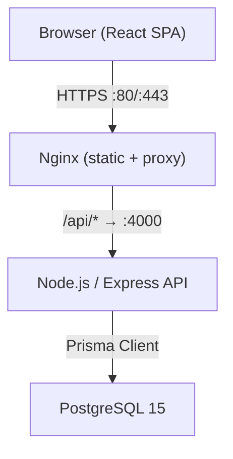

# Restaurant App

<!-- Badges -->


A full-stack restaurant ordering platform. Customers browse a menu, manage a cart, and place orders. Administrators manage menu content, process orders, and view sales analytics.

---

## Tech Stack

| Layer | Technology |
|-------|-----------|
| Frontend | React 18, Vite, TypeScript, Tailwind CSS, React Router v6 |
| Backend | Node.js 20, Express, TypeScript, Prisma ORM, Zod |
| Database | PostgreSQL 15 |
| Auth | JWT (24-hour stateless tokens), bcrypt (rounds = 12) |
| Containerisation | Docker, Docker Compose, Nginx |
| CI/CD | GitHub Actions → GHCR |

---

## Setup

### Prerequisites

| Tool | Minimum Version |
|------|----------------|
| Node.js | 20 |
| npm | 9 |
| Docker | 24 |
| Docker Compose | 2.20 |

### Local development (Docker Compose)

```bash
# 1. Clone the repository
git clone https://github.com/your-org/restaurant-app.git
cd restaurant-app

# 2. Copy the environment file and edit values if needed
cp .env.example .env

# 3. Start all services (database, backend, frontend)
docker-compose up
```

The services will be available at:

| Service | URL |
|---------|-----|
| Frontend | http://localhost:5173 |
| Backend API | http://localhost:4000 |
| Swagger UI (dev) | http://localhost:4000/api/docs |

### Running tests

```bash
# Backend tests (with coverage)
npm run test --workspace=backend -- --coverage

# Frontend tests
npm run test --workspace=frontend -- --run

# Lint both workspaces
npm run lint --workspaces
```

---

## Architecture



### Monorepo structure

```
restaurant-app/
├── frontend/          # Vite + React SPA
├── backend/           # Express REST API
├── docker-compose.yml
├── docker-compose.prod.yml
├── .env.example
└── README.md
```

---

## Environment Variables

All variables are documented with inline comments in `.env.example`. The table below is a quick reference.

| Variable | Required | Description |
|----------|----------|-------------|
| `POSTGRES_DB` | Yes | PostgreSQL database name |
| `POSTGRES_USER` | Yes | PostgreSQL user |
| `POSTGRES_PASSWORD` | Yes | PostgreSQL password |
| `DATABASE_URL` | Yes | Prisma connection string |
| `JWT_SECRET` | Yes | Secret for signing JWTs (min 32 chars) |
| `NODE_ENV` | Yes | `development` \| `test` \| `production` |
| `PORT` | Yes | Express server port (default `4000`) |
| `VITE_API_BASE_URL` | Yes | API base URL used by the frontend at build time |
| `GITHUB_REPOSITORY` | CI/CD | Repository slug used to tag GHCR images — set in GitHub Actions secrets, not committed |

---

## CI/CD

Two GitHub Actions workflows ship the project:

| Workflow | Trigger | Jobs |
|----------|---------|------|
| **CI** (`.github/workflows/ci.yml`) | PR → `develop` or `main` | `install` → `lint` → `test-backend` + `test-frontend` → `docker-build` |
| **CD** (`.github/workflows/cd.yml`) | Push → `main` | `build-and-push` (tags images with `github.sha` and `latest` to GHCR) |

### Production deployment

```bash
# Pull and start production containers (images built by the CD workflow)
IMAGE_TAG=latest docker-compose -f docker-compose.prod.yml up -d
```

---

## Contributing

1. Create a feature branch from `develop`.
2. Open a pull request targeting `develop` — CI must be green before merging.
3. Merges to `main` trigger the CD pipeline automatically.
